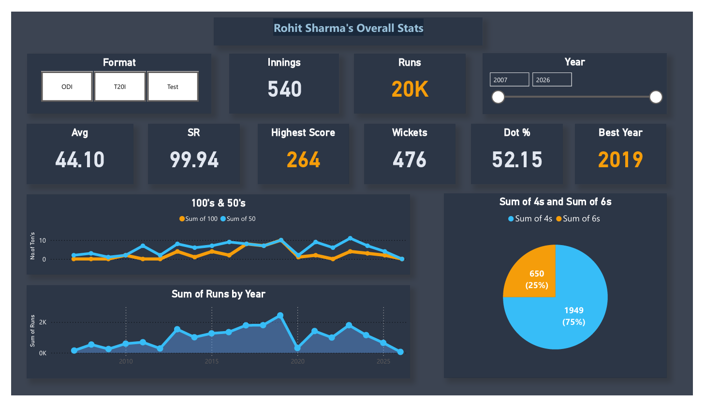

# 🏏 Rohit Sharma Performance Dashboard

## 📌 Project Overview
This project is an interactive **Cricket Performance Dashboard** built using Power BI, analyzing the career statistics of Rohit Sharma across different formats (ODI, T20I, Test).

The dashboard provides insights into batting performance, consistency, and yearly trends.

---

## 🚀 Features
- 📊 Total Runs, Innings, and Key Metrics
- 📈 Batting Average & Strike Rate Analysis
- 💯 Highest Score Tracking
- 🎯 Dot Ball Percentage
- 🏆 Best Performance Year Identification
- 📅 Year-wise Filtering (2007–2026)
- 📉 Runs Trend Over Years
- 🔢 100s & 50s Comparison
- 🏏 Boundary Analysis (4s vs 6s)
- 📌 Format Selection (ODI, T20I, Test)

---

## 📷 Dashboard Preview

---

## 🛠️ Tools & Technologies
- Power BI
- Data Visualization
- DAX (Data Analysis Expressions)
- Data Cleaning

---

## 📊 Key Insights
- Total runs exceed **20,000** across formats
- Highest score recorded: **264** (ODI)
- Best year: **2019**
- Strong consistency with multiple 100s & 50s
- Majority boundaries are **4s (75%)** compared to 6s
- Peak performance observed between 2017–2019

---

## 📂 Dataset
- Player statistics dataset including:
  - Matches / Innings
  - Runs scored
  - Strike Rate
  - Average
  - Boundaries (4s & 6s)
  - Year-wise performance

---

## 🎯 Purpose
- Demonstrate **sports analytics skills**
- Showcase **Power BI dashboard design**
- Add unique project to data analyst portfolio

---

## ⭐ Support
If you like this project, give it a ⭐ on GitHub!
